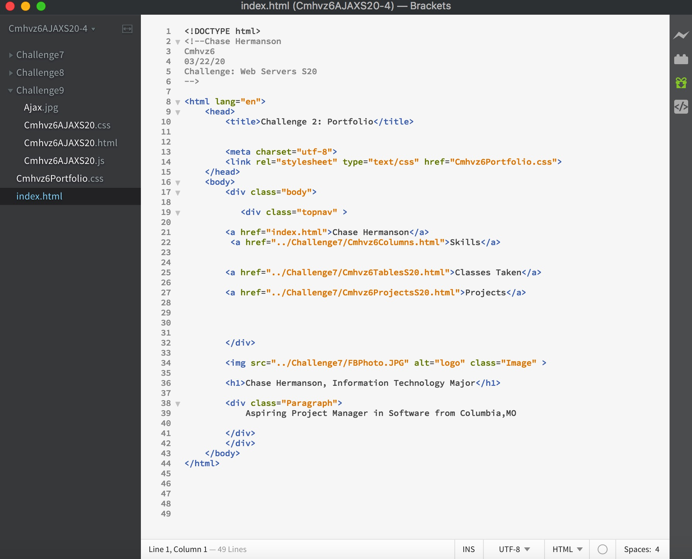
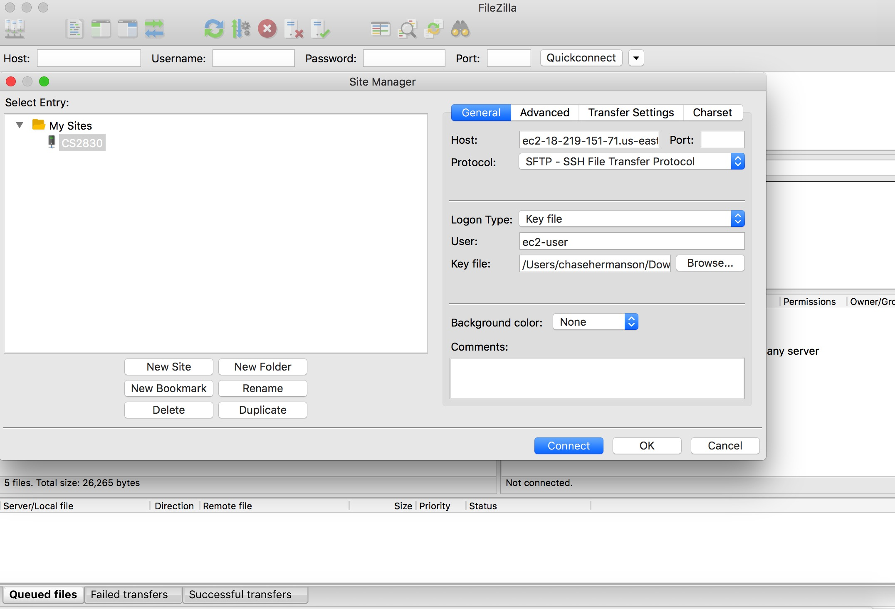
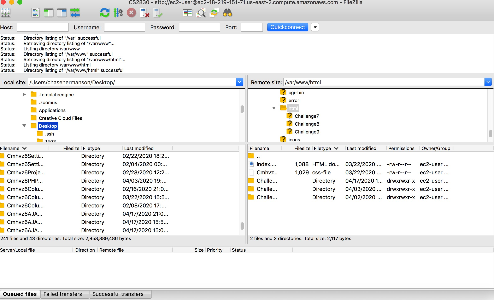

# Hosting Code to AWS Server Via FileZilla
### Created by Chase Hermanson (Cmhvz6)

## This tutorial will show the basics steps that are necessary to take in order to house your HTML/CSS code to a AWS server. FileZilla will be used as the transfer system between your local system and your server.
## The inteneded audience would be early year web devolopers who have basic AWS and terminal experience. As long as they have been exposed to basic IT/CS technology, they should have no problem setting the connection. They may not have the HTML/CSS to have anything populated to the HTML server, but at least the connection between the local host and AWS server will be there.


## First steps would be to launch the AWS Instance. This is assumed you have an AWS educate or AWS credits because launching an instance is not free.


## Next you'll have to configure your instance type and instance settings, this is all dependent on what you plan on doing. I currently have an AMAZON LINUX 2 AMI instance running, so I will be using that for this tutorial.


## And next youll have to select the instance type. And for demostration purposes I have t2.micro General purpose instance selected, mostly because it is eligible with the free tier. You're now ready to launch the instance and connect to it.


## You will need to create a key pair. It will be a .pem file in order to be used with OpenSSH.

In the terminal run ``` *ssh -i **/path/my-key-pair.pem** ec2-18-219-151-71.us-east-2.compute.amazonaws.com* ```


## Once the instance is up and running and you are connected via your .pem file, next you have to set up a public HTML. You will run the following code in your terminal. The below code installs the most up to date versions of the neccessary applications.

```
**sudo yum install -y httpd24 php56 mysql55-server php56-mysqlnd**
**sudo service httpd start**
**sudo chkconfig httpd on**
**sudo chmod 777 /var/www/html**
```

## /var/www/html is the file path where you will host your HTML and CSS files and directories, and this is where the EC2 instance will look for the files to populate the server.


## I used Brackets as my text editor and the files that are linked to Filezilla. The files that are in brackets, must be named correctly and the code must have the correct paths to showcase the code on the server.


## Once the code is organized correctly on your local computer, you need to connect to Filezilla in order to send to the server. In FileZilla you want to navigate to the site manager. There is where you will need to put in the correct settings. 

```

Host: Your public DNS of ec2 instance
Protocol: SFTP
Logon Type: Normal
User: For Amazon Linux, the default user name is ec2-user. For RHEL5, the user name is often root but might be ec2-user.
FileZilla automatically figures out which key to use.
```


## When in FileZilla, you will need to Navigate to the /var/www/html directory on the right side, which is the server side. You do this becuase we set up the public Html earlier, and only items in the HTML directory will be housed on the server.




